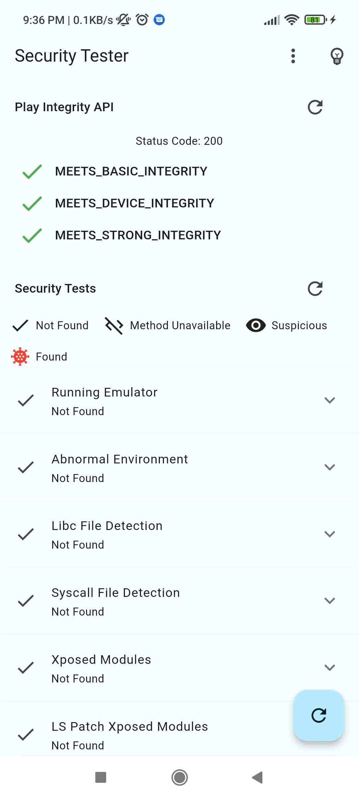
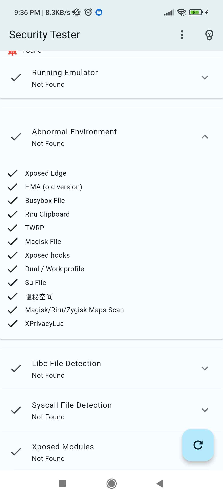
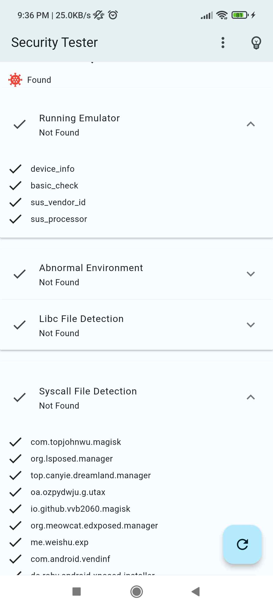
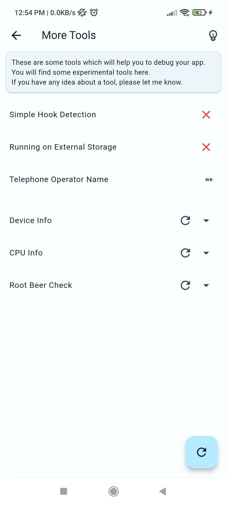
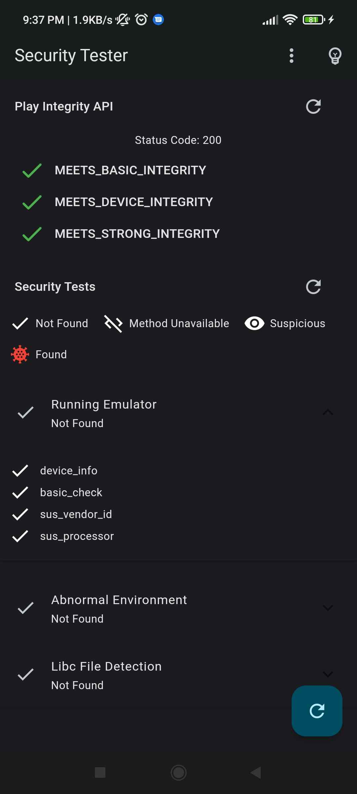

# Security Tester

    

The app contains a suit of simple additional offline tools like (Rootbeer, and Check if running on External Storage) you can use them in your app by navigating to the `More Tools` screen.

To learn more about contributions, See the [contribution](#contribution) section.

**This is not an officially supported Google product**

| Major Checks | More Major Checks |
|---|---|
|  |  |

| Again Major Checks | More Tools | Dark Mode |
|---|---|---|
|  |  |  |

## Usage

- **Security Tests** Are a suit of offline tests and don't need any internet connection.

- **Play Integrity API** Is an online tool which needs to access the internet to be able to work. To learn more about Play Integrity, Check out the [official docs](https://developer.android.com/google/play/integrity).

    > Note: Play Integrity API is only available for apps that are published on Google Play Store.

    > To learn more about using the API when cloning this project, See the [Play Integrity API](./CONTRIBUTING.md#how-to-use-play-integrity-api) section.

### Contribution

Feel free to contribute to this project by creating issues or pull requests. Any help is appreciated ❤️. Check out the [CONTRIBUTING.md](./CONTRIBUTING.md) file for more info.
